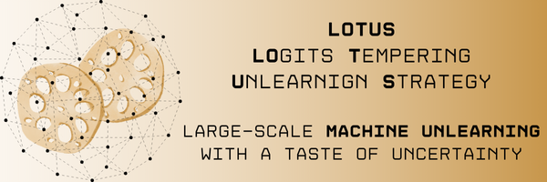
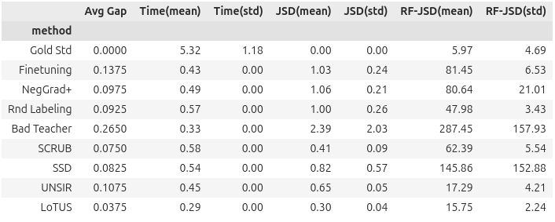

# Descritption
This repository includes the documented code to set up the experimental set up and reproduce the results presented in the paper **LoTUS: Large-Scale Machine Unlearning with a Taste of Uncertainty**.

LoTUS is a novel Machine Unlearning (MU) method that eliminates the influence of training samples from pre-trained models. LoTUS smooths the prediction probabilities of the model, mitigating its over-confidence that stems from data memorization, up to an information-theoretic bound. We evalutate LoTUS on the Transformer and ResNet18 models, against seven baseline methods, on four public datasets. Beyond established MU benchmarks, we evaluate unlearning on a large-scale dataset (ImageNet1k) which deters retraining, simulating real-world conditions. Moreover, we introduce the novel **Retrain-Free Jensen Shannon Divergence (RF-JSD)** metric to enable evaluation under real-world conditions. Experimental results show that LoTUS outperforms state-of-the-art methods in terms of both efficiency and effectiveness.

# Reproducibility
All results presented in the paper can be reproduced. They are documented in Jupyter notebooks, as shown below:


Below is a mapping of the Tables and Figures from the paper to the corresponding notebooks:
| Tables and Figures | Corresponding Notebooks |
|--------------------|-------------------------|
| Table 1: Performance Summary | `notebooks/results.ipynb` |
| Table 2: Scaling up the Forget set | `notebooks/results.ipynb` |
| Table 3: Large-Scale Unlearning | `notebooks/results_imagenet.ipynb` |
| Table 4: Accuracy Metrics | `notebooks/results.ipynb` |
| Table 5: Scaling up the Forget set (Appendix) | `notebooks/results.ipynb` |
| Table 6: RF-JSD and JSD Correlation | `notebooks/results.ipynb` |
| Figure 2: Streisand Effect | `notebooks/streisand.ipynb` |
| Figure 3: Duplicates in MUFAC | `notebooks/clean_MUFAC.ipynb` |
| Figure 4: MUFAC Class Distribution | `notebooks/EDA_MUFAC.ipynb` |
| Figure 5: Failure Analysis | `notebooks/check_orthogonality.ipynb` |

The results are reproduced following the steps 1--4:

## Step 1: Environment Setup
The environment 'MaUn' contains Conda and Pip packages. You can install them using the `environment.yml` file:
1. In the last line of the file, replace \<username\> with your username.
2. ```conda env create -f environment.yml```
3. ```conda activate MaUn```
If this fails, you can install the Conda and Pip packages explicitly using the `conda_requirements.txt` and `pip_requirements.txt` explicitly. If the installation of a package fails, then try to remove the version (e.g., mlflow==2.8.0 &rarr; mlflow) in the corresponding file.

We use Python 3.11.5 and CUDA 12.1 in Ubuntu 24.04.1 LTS.

## Step 2: Datasets
* CIFAR-10/100
    1. These datasets are downloaded automatically in `~/home/data/`.
    2. You can define how many training samples are designated for unlearning using the `frac_per_class_forget` variable of the `UnlearningDataLoader` class in `src/helpers/data_utils.py`.
* MUFAC:
    1. Download the original dataset following the instruction [here](https://github.com/ndb796/MachineUnlearning).
    2. Move the `custom_korean_family_dataset_resolution_128/` folder into the `~/home/data/` folder.
    3. Run `notebooks/clean_MUFAC.ipynb` to clean the dataset and create the `~/home/data/custom_korean_family_dataset_resolution_128_clean\` folder.
* ImageNet1k:
    1. Download the dataset from [image-net.org](image-net.org).
    2. Our `~/home/data/pytorch_imagenet1k` folder looks like this:
    ```
    pytorch_imagenet1k/
    ├── ILSVRC2012_devkit_t12.tar.gz
    ├── ILSVRC2012_img_train.tar.gz
    ├── ILSVRC2012_img_val.tar.gz
    ├── train/ 
    ├── val/ 
    └── meta.bin 
    ```
## Step 3: MLflow Setup
Set your `mlflow_tracking_uri` in `src/helpers/mlflow_utils`. You assign it once, only in this file.

## Step 4: Running the Project
Run the `src/bash_scripts/reproduce_results.sh` file.

## Hardware
For ImageNet1k781 experiments, we used an NVIDIA RTX A6000 48GB GPU.  The remaining experiments were performed on an NVIDIA RTX 4080 16GB GPU. We also used an Intel i7-12700K CPU and 32GB of RAM.

# Unlearning Methods 
All the methods are implemented in `src/unlearning_methods/`.
| Method | File | Paper | Code |
|--------|------|-------|------|
| **LoTUS** | `our_class.py` | todo | todo |
| Finetuning | `naive_unlearning_class.py` | [:closed_book:](https://arxiv.org/abs/2302.09880) |  |
| NegGrad+ | `naive_unlearning_class.py` | [:closed_book:](https://arxiv.org/abs/2302.09880) |  |
| Rnd Labeling | `naive_unlearning_class.py` | [:closed_book:](https://arxiv.org/abs/2010.10981) | |
| Bad Teacher | `bad_teaching_class.py` | [:closed_book:](https://arxiv.org/abs/2205.08096) | [:computer:](https://github.com/vikram2000b/bad-teaching-unlearning) |
| SCRUB | `scrub_class.py` | [:closed_book:](https://arxiv.org/abs/2302.09880) | [:computer:](https://github.com/meghdadk/SCRUB) |
| SSD | `ssd_class.py` | [:closed_book:](https://arxiv.org/abs/2308.07707) | [:computer:](https://github.com/if-loops/selective-synaptic-dampening) |
| UNSIR | `unsir_class.py` | [:closed_book:](https://arxiv.org/abs/2111.08947) | [:computer:](https://github.com/vikram2000b/Fast-Machine-Unlearning) |

# Evaluation Metrics
All the evaluation metrics are implemented in `src/helpers/eval.py`.
| Metric | Paper | Code | 
|--------|-------|------|
|Accuracy| | |
|**Retrain-Free Jensen-Shannon Divergence (RF-JSD)**| todo | todo |
|Jensen-Shannon Divergence (JSD)| [:closed_book:](https://arxiv.org/abs/2205.08096) | [:computer:](https://github.com/vikram2000b/bad-teaching-unlearning) |
| MIA | [:closed_book:](https://arxiv.org/abs/2308.07707) [:closed_book:](https://arxiv.org/abs/2205.08096) | [:computer:](https://github.com/if-loops/selective-synaptic-dampening) [:computer:](https://github.com/vikram2000b/bad-teaching-unlearning)|

# Project Structure
The project is organized as follows:
```
LoTUS/
├── notebooks/
│   ├── check_orthogonality.ipynb
│   ├── clean_MUFAC.ipynb
│   ├── EDA_MUFAC.ipynb
│   ├── results_imagenet.ipynb
│   ├── results.ipynb
│   ├── streisand.ipynb
│   ├── clean_MUFAC.ipynb
|   └──
├── src/
│   ├── bash_scripts/ 
|   |   ├── dataset_ablation.sh
|   |   ├── reproduce_results.sh
|   |   └── tuning.sh
|   ├── helpers/
|   |   ├── config.py
|   |   ├── data_utils.py
|   |   ├── eval.py
|   |   ├── mlflow_utils.py
|   |   ├── models.py
|   |   ├── mufac_utils.py
|   |   └── seed.py
|   ├── unlearning_methods/
|   |   ├── bad_teaching_class.py
|   |   ├── naive_unlearning_class.py
|   |   ├── our_class.py
|   |   ├── scrub_class.py
|   |   ├── ssd_class.py
|   |   ├── unlearning_base_class.py
|   |   └── unsir_class.py
│   ├── original_imagenet.py
│   ├── original_imagenet.py
│   ├── retrain.py
│   ├── train.py
│   ├── unlearn_imagenet.py
│   └── unlearn.py
├── environment.yml
├── conda_requirements.txt
├── pip_requirements.txt
└── README.md
```

## Citation
TODO